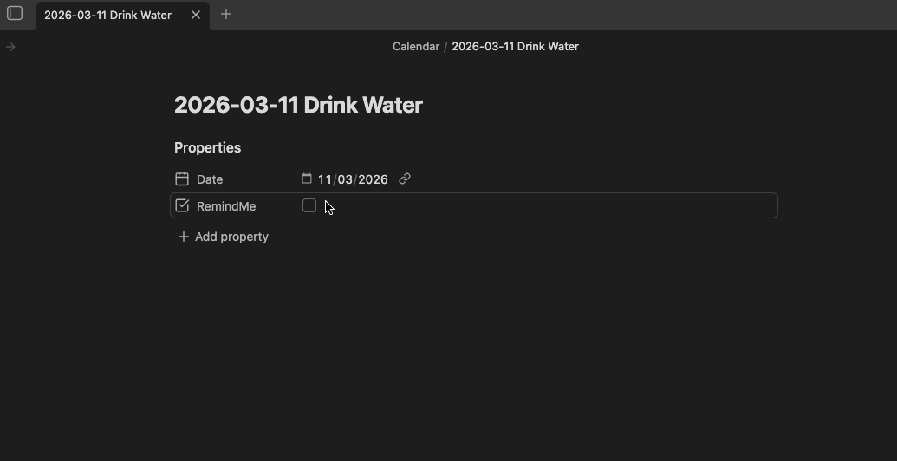

# Obsidian Reminders External Notifications
Adds quick reminders for notes, and the possibility of sending the reminders information to an external endpoint (to use in conjunction with [ntfy.sh](ntfy.sh) for example).

> [!Warning: Network use]+
> This plugin can send data outside of your vault. 
> It only sends the data of the reminders you configure (see [[#External reminder API]], and only to the URL you specifically provide. 
> It is configurable and you can disable it entirely in the plugin settings via the `Send reminders to external API ?` toggle. 
# Why this plugin
One of the uses I have for Obsidian is a very modular calendar ([OZ Calendar](https://github.com/ozntel/oz-calendar) is what I currently use to display my calendar events).
This plugin is born to the need of a solution similar to Notion's "Remind" feature on dates, with the possibility to receive *real* notifications for events, on all my devices because I tend to forget a lot of stuff.
Currently it only allows for file-level reminders since it fits my main use-case, I'm thinking about adding support for inline **reminders** too (see [[#Feature ideas]]). 

> [!Disclaimer]+
> This is my 1st Obsidian plugin, and 1st open source project as well. I'm a pragmatic hobbyist programmer that loves tinkering with the tools he uses, but I'm nowhere near the level of a professional developer so the code is amateur-level at best, but functional enough for me to feel like sharing it. Use at your own risk !

# How to use
When checking the `RemindMe` property of a note (or whatever checkbox property you define in the plugin settings), select when you want to be reminded of this event from the suggested delays.


## External reminder API
If you have defined an external endpoint, the plugin will call this endpoint with the following information in the request body :

```
{
  # ntfy specific properties, for easy notifications setup
  "topic": "my-topic", #Topic name where the notification will be published
  "message": "Happening on Wed 12 at 15:30", #Body of the notification
  "title": "Reminder : Drink water", # Title of the notification
  "tags": [
    "alarm_clock"
  ], #Icons/Tags to use in the notification
  "click": "obsidian://open?vault=TestingVault&file=Calendar%2FDrink%20Water.md", #Link to the note where the reminder was set
  "delay": "1773043200", #Unix epoch date, when should the reminder notification be sent
  # Generic content, for more customized workflows, will be ignored by ntfy
  "reminderInfo": {
    "event_date": "2026-03-11", #ISO date for the event
    "remind_date": "2026-03-09T09:00:00.000+02:00", #ISO date for the reminder
    "file_title": "Drink water", #Title of the file, used in the notification title
    "hash": "33997cd8aa4b92f9d620042c9892072d" #Hash calculated from event_date & file_link, useful to avoid reminder duplication
  }
}
```

`topic`, `message`, `title`, `tags`, `click` and `delay` are base parameters that ntfy can use to create a reminder. 
`reminderInfo` is an additional object with more information, in case you want to send the data through a middleware first (see [[#Advanced notifications with selfhosted ntfy and middleware]])
## Additional headers
You can add 1 or more custom HTTP headers that will be send along the API request, for example to support authenticated proxies, tunnels and SSO.

## Example setup
### Simple notifications with [ntfy.sh](ntfy.sh)
With the current implementation, you can totally rely on the public version of ntfy.sh to manage your notifications. See https://docs.ntfy.sh/ for more details on how to setup & use [ntfy.sh](ntfy.sh).
Once you have created a topic, simply add `https://ntfy.sh` as the API endpoint and your topic name in the plugin settings and voilà!

> [!Considerations when using ntfy.sh]
> [ntfy.sh](ntfy.sh) has some limitations in its use :
> * **You cannot schedule a notification later than 3 days after the current day** 
> * Similarly, you cannot schedule a notification for a date that is before the current date
> * Each time you setup a reminder, ntfy will register a notification, which could result in multiple notifications for the same event if you toggle "RemindMe" multiple times
> * The topics you create are "public", anyone (if they find the topic name you're using) can send and receive notifications on your topic
> * ntfy.sh is a third party, so avoid sending sensitive/personal data in your notifications
> 
> For more informations on topics and limitations : https://docs.ntfy.sh/publish/#public-topics
### Advanced notifications with selfhosted ntfy and middleware
Since this plugin was originally developed for my personal use and given the limitations detailed above, I'll share here how I setup my current notification system. 

I've set up the plugin to call a webhook configured in a self hosted [N8N](https://n8n.io/) container instead, which handles the data transformation, deduplication (using the hash in the `reminderInfo`), and sending the notification only when necessary to my ntfy container.
This gives me control over what the notification looks like, where my notification data is stored and much more. 
You can find information on how to self host ntfy here : https://docs.ntfy.sh/install/
and N8N here : https://docs.n8n.io/hosting/.

# Feature ideas
- Allow mapping for more ntfy parameters in the settings
- Use a list of options for body format (default, ntfy, other ?) instead of everything in the same body
- More detailed error handling (especially for API interactions)
- Inline reminders
- Finer reminder delays/user defined delays/custom delays
